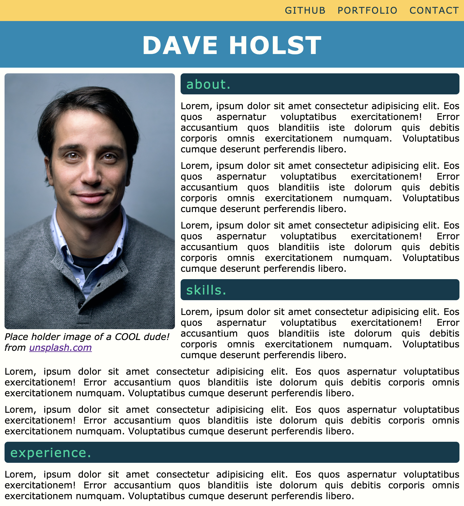

# Week 1 Landing Page Activity

Landing Page activity for end of Week 1. Using our git/html/css skills for a task.

## Screenshot

## Instructions

Work in your group to implement the following user stories:

- [x] As a client, I want to view a single webpage that collects a visitor's contact information.
- [x] As a client, I want the landing page to have a header and footer.
- [x] As a client, I want the landing page to have an image with a caption.
- [x] As a client, I want the landing page to have a contact form.
- [x] As a client, I want the landing page to have a polished and accessible UI.

## Acceptance Criteria

- [x] It's done when the page uses semantic HTML elements.
- [x] It's done when the page uses universal, element, and class selectors in CSS.
- [x] It's done when the page features at least three colors in the design.
- [x] It's done when the page uses a single font and font family for all text.
- [x] It's done when the page uses at least two heading elements (`<h1>` through `<h6>`).
- [x] It's done when the header is fixed to the top of the page on scroll.
- [x] It's done when the header contains a navigation bar with three links that display inline, including a contact link.
- [x] It's done when, if the contact link is clicked, the page jumps directly to the contact form.
- [x] It's done when the contact form includes `input` elements for name and email.
- [x] It's done when the contact form includes a Send button.
- [x] It's done when the image includes a descriptive `alt` attribute.
- [x] It's done when the page is deployed to GitHub Pages.

## Extra TODO

- [x] Setup github pages on this repo
- [x] Add Screen shot to README
- [x] Test Access via GitHub Pages
- [x] Lighthouse accessibility report? -- Accessibility Score 96%

## Notes

- h2 margins not responsive (problem on skills. h2) I guess you would use grid/flex for this? might be able to achieve with media queries? didn't want to waste too much time on this.
- proabable should have used more divs :rofl: it is pretty jank.
- or put a border same colour as background aroung portrait. Wouldn't solve radius on heading issue.
